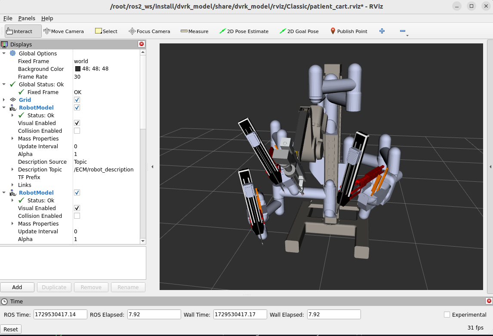
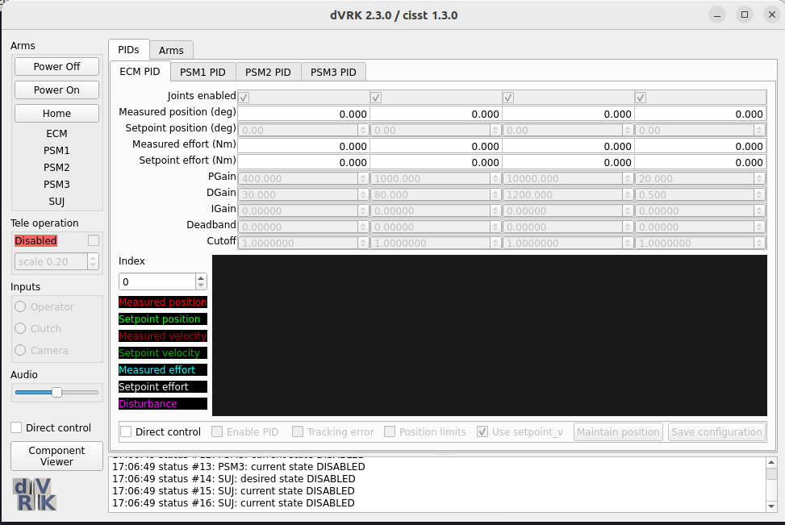
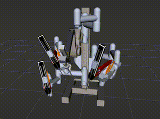

# dVRK ROS

## Introduction

### What is dVRK?

The dVRK (da Vinci Research Kit) is a robotic surgical platform that allows researchers to explore and develop innovative robotic applications. This repository provides an environment for facilitating better development and experimentation with the dVRK robot in simulation.

## Prerequisites

To set up the environment for the dVRK robot, ensure you have the following software installed:

- **Docker Desktop**: Used for containerization.
- **xterm**: Required for running GUIs within Docker containers.

## Build Instructions

First, we need to build the Docker image. To build the image, run the following script:

```bash
cd docker
./build.sh
```

You can verify the build by checking the Docker images available on your system:

```bash
docker image list
```

You'll see an image called `dvrk` in the list.
## Running

### Terminal 1

To run the Docker container, use the following command:

```bash
./run.sh
```

Inside the container, you need to run the following command:

```bash
# The source has already been done in the entry point file, so you can skip this line and move to the launch
source ~/ros2_ws/install/setup.bash
```

Then, launch the dVRK simulation using:

```bash
ros2 launch dvrk_model patient_cart.launch.py generation:=Classic
```

This opens up RViz and dVRK windows as shown below.

<div style="text-align: center;">
    
    
</div>

Press the `Power On` and the `Home` buttons and (optionally) select a tool from the drop down menu for the arm that you intend to use. 

**Note**: Remember to add `.py` to the launch file name. In ROS 2 (starting with the Foxy release), the convention for launch files has changed from XML (`.launch`) to Python (`.launch.py`). As a result, all ROS 2 launch files need to have the `.launch.py` extension, whereas in ROS 1, the `.launch` extension was used.


### Terminal 2

In a new terminal, execute the following command to access the running container:

```bash
docker exec -it dvrk_container bash
```

Then, you can run the following command:

```bash
ros2 run dvrk_python dvrk_arm_test.py -a PSM1
```

This should move the arm as shown below:

<div align="center">



</div>


**Note**: If you encounter any errors, you can use the following command to ensure that the messages are being published correctly:

```bash
ros2 topic echo
```

## Contact

For any ROS-related questions, feel free to reach out via email at [minahilrz@gmail.com](mailto:minahilrz@gmail.com).